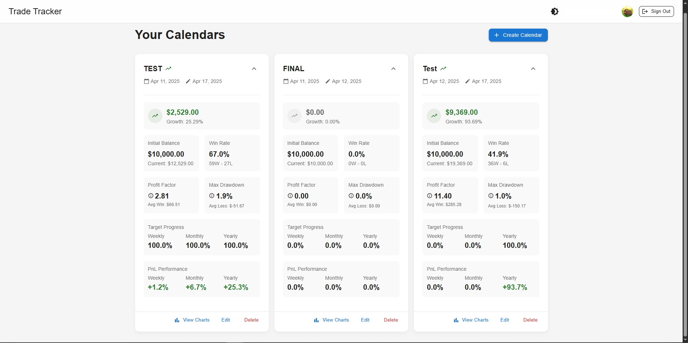
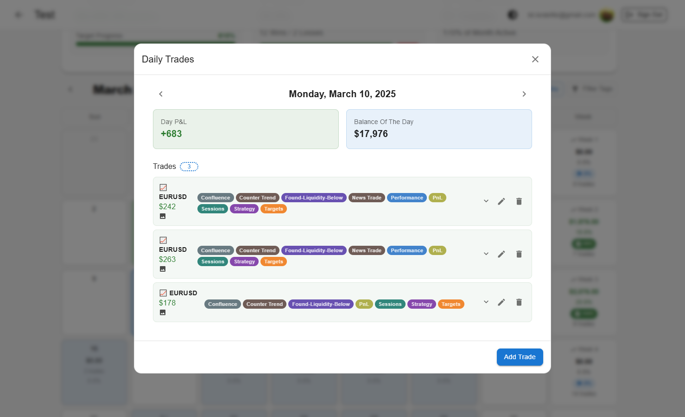
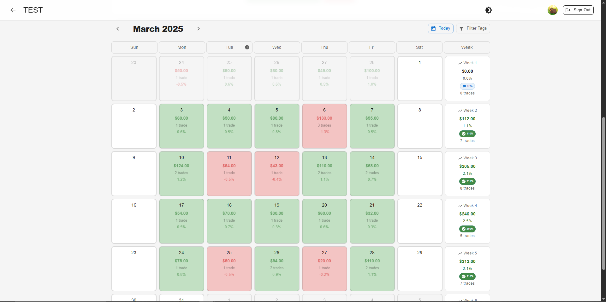
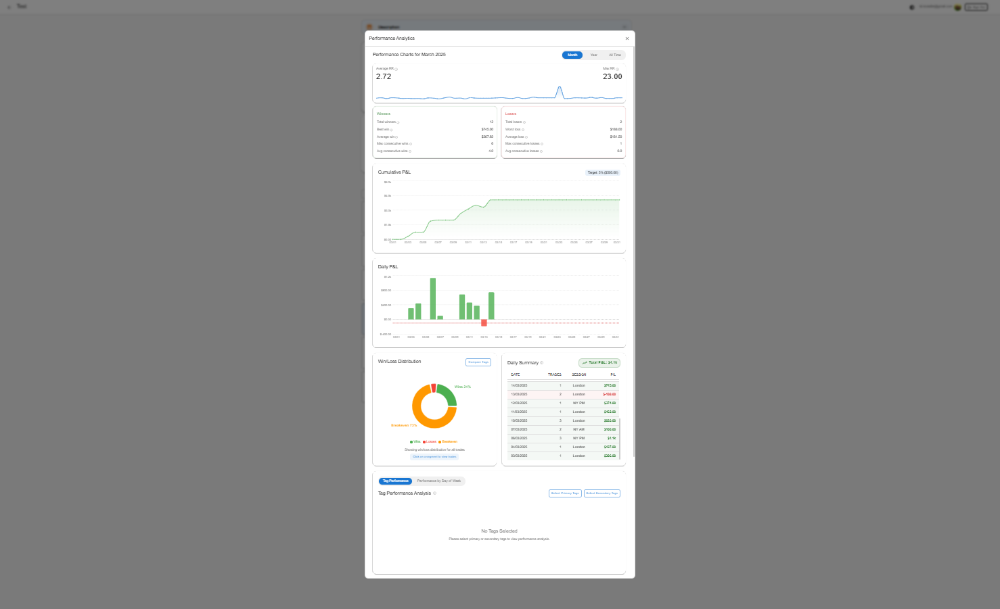
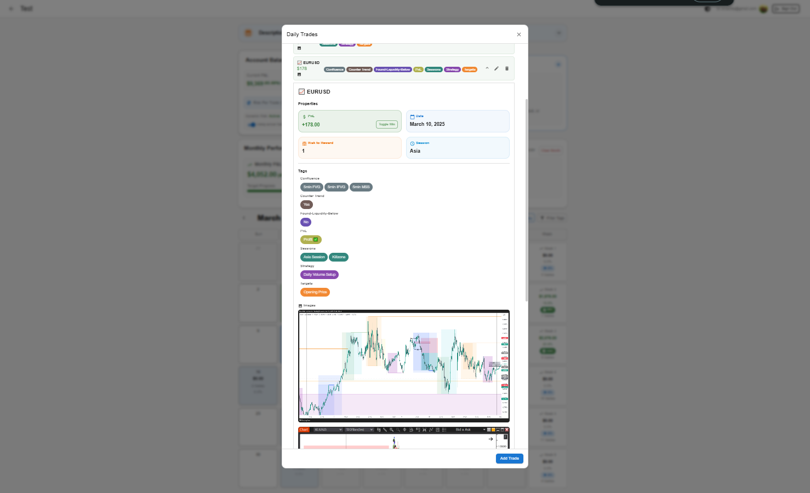
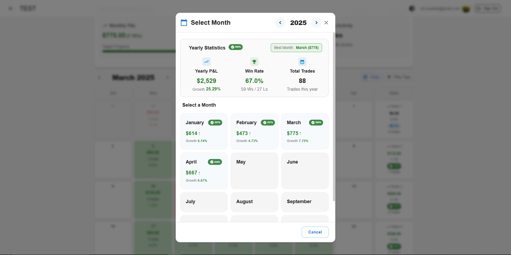

# Trade Tracker

A React application for tracking and analyzing trading activities.



## Features

### Trade Management
- Track trades with date, amount, type (win/loss/breakeven), and risk-to-reward ratio
- Add detailed trade information including name, entry/exit points, and partials
- Organize trades with customizable tags and tag categories
- Add multiple images to trades with customizable layouts and captions
- Import and export trade data in various formats including CSV

<p align="center">
  
  <br>
  <em>Trade journal with detailed fields and image upload</em>
</p>

### Calendar and Notes
- View trades in an intuitive calendar interface
- Add notes to specific days of the week
- Add a general calendar note for broader context
- Filter trades by tags to focus on specific strategies

### Risk Management
- Set account balance and risk per trade percentage
- Configure dynamic risk adjustment based on performance thresholds
- Toggle between actual trade amounts and calculated amounts based on risk management rules
- See how your account would have performed with strict risk management

<p align="center">
  
  <br>
  <em>Calendar view showing trades with risk management information</em>
</p>

### Analytics and Performance
- View comprehensive statistics including win rate, profit factor, and drawdown
- Analyze performance by day of week, tag, and time period
- Track progress toward weekly, monthly, and yearly targets
- Visualize performance with charts and graphs

<p align="center">
  
  <br>
  <em>Performance charts showing trading metrics and analysis</em>
</p>

### User Experience
- Dark/light theme support with persistent preference
- Responsive design for all devices
- Real-time updates and data synchronization
- Firestore integration for secure cloud storage

## Technologies Used

- React with TypeScript for type-safe development
- Material-UI for responsive, modern UI components
- Firebase/Firestore for real-time database and authentication
- Firebase Storage for image storage and management
- Firebase Cloud Functions for server-side processing
- date-fns for comprehensive date manipulation
- UUID for unique identifier generation
- Chart.js for interactive data visualization

## Getting Started

### Prerequisites

- Node.js (v14 or higher)
- npm or yarn

### Installation

1. Clone the repository:
   ```
   git clone https://github.com/yourusername/simple-trade-tracker.git
   cd simple-trade-tracker
   ```

2. Install dependencies:
   ```
   npm install
   ```
   or
   ```
   yarn install
   ```

3. Start the development server:
   ```
   npm start
   ```
   or
   ```
   yarn start
   ```

4. Open [http://localhost:3000](http://localhost:3000) to view it in your browser.

## Usage

### Trade Management
- Add new trades by clicking on any day in the calendar
- Edit or delete existing trades using the action buttons
- Upload images to trades by dragging and dropping or using the file selector
- Customize image layouts by dragging to resize and reposition
- Add tags to trades for better organization and filtering

### Risk Management
- Set your account balance and risk per trade percentage in the Account Stats section
- Enable dynamic risk to automatically adjust risk based on performance
- Use the toggle switch to see how your account would perform with calculated trade amounts based on your risk settings

### Analytics
- View daily, weekly, and monthly performance statistics
- Click on the performance button to see detailed analytics
- Filter trades by tags to analyze specific strategies
- Track progress toward your trading targets

### Data Management
- Import/export trades using the buttons in the monthly stats section
- Add notes to specific days or to the entire calendar
- Toggle between dark and light themes using the button in the top-right corner
- Use the year selector to navigate between different years of trading data

## License

This project is licensed under the MIT License - see the LICENSE file for details.

## Recent Enhancements

### Dynamic Risk Toggle
- Added a toggle button in the Account Stats component to switch between actual trade amounts and calculated amounts based on risk management rules
- Implemented real-time recalculation of trade amounts based on risk per trade and risk-to-reward ratios
- Added a tooltip explaining the purpose and functionality of the toggle
- Ensured all calculations happen in memory without modifying the actual data in Firebase

<p align="center">
  
  <br>
  <em>Detailed trade view with risk management settings and analytics</em>
</p>

### Image Management
- Implemented drag-and-drop functionality for image uploads
- Added support for image resizing and repositioning
- Implemented custom image layouts with persistence to Firebase
- Added caption support for images

<p align="center">
  
  <br>
  <em>Yearly statistics dashboard with comprehensive performance metrics</em>
</p>

### Tag System
- Implemented hierarchical tags with category:value format
- Added tag filtering functionality affecting account balance and monthly stats
- Implemented tag color coding based on tag names
- Added tag suggestions based on existing tags

### Performance Analytics
- Added interactive charts for analyzing performance by day of week and tag
- Implemented tag performance analysis to identify most profitable strategies
- Added drawdown tracking and visualization
- Implemented progress tracking toward weekly, monthly, and yearly targets

## Acknowledgments

- Material-UI for the component library
- Firebase for the backend infrastructure
- date-fns for date manipulation
- Chart.js for data visualization
