# Simple Trade Tracker - Database Schema ERD

## Entity Relationship Diagram

```mermaid
erDiagram
    USERS {
        uuid id PK
        text firebase_uid UK "Migration compatibility"
        text email UK
        text display_name
        text photo_url
        text provider
        timestamptz created_at
        timestamptz updated_at
        timestamptz last_login
        boolean is_active
    }

    CALENDARS {
        uuid id PK
        uuid user_id FK
        text name
        timestamptz created_at
        timestamptz updated_at
        decimal account_balance
        decimal max_daily_drawdown
        decimal weekly_target
        decimal monthly_target
        decimal yearly_target
        decimal risk_per_trade
        boolean dynamic_risk_enabled
        decimal increased_risk_percentage
        decimal profit_threshold_percentage
        boolean duplicated_calendar
        uuid source_calendar_id FK
        boolean is_deleted
        timestamptz deleted_at
        uuid deleted_by FK
        timestamptz auto_delete_at
        text_array required_tag_groups
        text_array tags
        text note
        text hero_image_url
        jsonb hero_image_attribution
        jsonb days_notes
        jsonb score_settings
        jsonb economic_calendar_filters
        jsonb pinned_events
        decimal win_rate
        decimal profit_factor
        decimal max_drawdown
        decimal target_progress
        decimal pnl_performance
        integer total_trades
        integer win_count
        integer loss_count
        decimal total_pnl
        timestamptz drawdown_start_date
        timestamptz drawdown_end_date
        decimal drawdown_recovery_needed
        integer drawdown_duration
        decimal avg_win
        decimal avg_loss
        decimal current_balance
        decimal weekly_pnl
        decimal monthly_pnl
        decimal yearly_pnl
        decimal weekly_pnl_percentage
        decimal monthly_pnl_percentage
        decimal yearly_pnl_percentage
        decimal weekly_progress
        decimal monthly_progress
        text share_link
        boolean is_shared
        timestamptz shared_at
        text share_id UK
    }

    TRADES {
        uuid id PK
        uuid calendar_id FK
        uuid user_id FK
        text firestore_id "Migration compatibility"
        text name
        decimal amount
        text trade_type "win|loss|breakeven"
        timestamptz trade_date
        timestamptz created_at
        timestamptz updated_at
        decimal entry_price
        decimal exit_price
        decimal risk_to_reward
        boolean partials_taken
        text session "Asia|London|NY AM|NY PM"
        text notes
        text_array tags
        boolean is_deleted
        boolean is_temporary
        boolean is_pinned
        text share_link
        boolean is_shared
        timestamptz shared_at
        text share_id UK
    }

    TRADE_IMAGES {
        uuid id PK
        uuid trade_id FK
        uuid calendar_id FK
        uuid user_id FK
        text filename
        text original_filename
        text storage_path
        text url
        integer width
        integer height
        integer file_size
        text mime_type
        text caption
        timestamptz created_at
        timestamptz updated_at
    }

    ECONOMIC_EVENTS {
        uuid id PK
        text external_id UK
        text currency
        text event_name
        text impact "Low|Medium|High|Holiday|Non-Economic"
        date event_date
        timestamptz event_time
        text time_utc
        bigint unix_timestamp
        text actual_value
        text forecast_value
        text previous_value
        text actual_result_type "good|bad|neutral"
        text country
        text flag_code
        text flag_url
        boolean is_all_day
        text description
        text source_url
        text data_source
        timestamptz last_updated
        timestamptz created_at
    }

    TRADE_ECONOMIC_EVENTS {
        uuid id PK
        uuid trade_id FK
        uuid economic_event_id FK
        timestamptz created_at
    }

    SHARED_TRADES {
        uuid id PK
        text share_id UK
        uuid trade_id FK
        uuid calendar_id FK
        uuid user_id FK
        text share_link
        boolean is_active
        integer view_count
        timestamptz created_at
        timestamptz expires_at
        timestamptz last_viewed_at
        jsonb viewer_ips
    }

    SHARED_CALENDARS {
        uuid id PK
        text share_id UK
        uuid calendar_id FK
        uuid user_id FK
        text share_link
        boolean is_active
        integer view_count
        timestamptz created_at
        timestamptz expires_at
        timestamptz last_viewed_at
        jsonb viewer_ips
    }

    %% Relationships
    USERS ||--o{ CALENDARS : "owns"
    USERS ||--o{ TRADES : "creates"
    USERS ||--o{ TRADE_IMAGES : "uploads"
    USERS ||--o{ SHARED_TRADES : "shares"
    USERS ||--o{ SHARED_CALENDARS : "shares"
    
    CALENDARS ||--o{ TRADES : "contains"
    CALENDARS ||--o{ TRADE_IMAGES : "has_images"
    CALENDARS ||--o{ SHARED_CALENDARS : "shared_as"
    CALENDARS ||--o{ CALENDARS : "duplicated_from"
    
    TRADES ||--o{ TRADE_IMAGES : "has_images"
    TRADES ||--o{ TRADE_ECONOMIC_EVENTS : "linked_to_events"
    TRADES ||--o{ SHARED_TRADES : "shared_as"
    
    ECONOMIC_EVENTS ||--o{ TRADE_ECONOMIC_EVENTS : "linked_to_trades"
```

## Key Design Decisions

### 1. **Flattened Structure**
- **Firestore**: `calendars/{id}/years/{year}` subcollections
- **PostgreSQL**: Single `trades` table with `calendar_id` foreign key
- **Benefit**: Simpler queries, better performance, easier joins

### 2. **Normalized Relationships**
- **Users**: Central user table with Firebase UID for migration compatibility
- **Foreign Keys**: Proper referential integrity with CASCADE deletes
- **Junction Tables**: Many-to-many relationships (trades ↔ economic events)

### 3. **Migration Compatibility**
- **firebase_uid**: Maps to Firebase Auth users
- **firestore_id**: Preserves original Firestore document IDs
- **Flexible**: Can maintain both systems during migration

### 4. **Performance Optimizations**
- **Indexes**: Comprehensive indexing strategy for common queries
- **GIN Indexes**: For JSONB and array columns (tags, settings)
- **Composite Indexes**: Multi-column indexes for complex queries
- **Partial Indexes**: Conditional indexes for sparse data

### 5. **Security Model**
- **Row Level Security**: User-based data isolation
- **Public Sharing**: Controlled access to shared content
- **Firebase Auth Integration**: Uses Supabase auth.uid() function

### 6. **Data Types**
- **DECIMAL**: Precise financial calculations
- **TIMESTAMPTZ**: Timezone-aware timestamps
- **JSONB**: Flexible structured data (settings, metadata)
- **TEXT[]**: PostgreSQL arrays for tags
- **UUID**: Primary keys with better distribution

## Migration Mapping

| Firestore Collection | PostgreSQL Table | Notes |
|----------------------|-------------------|-------|
| `calendars` | `calendars` | Direct mapping with flattened structure |
| `calendars/{id}/years/{year}` | `trades` | Subcollection flattened to single table |
| `economicEvents` | `economic_events` | Direct mapping with normalized structure |
| `sharedTrades` | `shared_trades` | Enhanced with tracking features |
| `sharedCalendars` | `shared_calendars` | Enhanced with tracking features |
| Firebase Auth Users | `users` | Explicit user table for better control |
| Firebase Storage refs | `trade_images` | Metadata table for image management |

## Query Performance

### Common Query Patterns
1. **User's Calendars**: `calendars.user_id + is_deleted = false`
2. **Calendar Trades**: `trades.calendar_id + trade_date range`
3. **Trade Images**: `trade_images.trade_id`
4. **Economic Events**: `economic_events.event_date + currency + impact`
5. **Tag Filtering**: GIN index on `trades.tags` array
6. **Statistics**: Aggregations on `trades` grouped by calendar

### Index Strategy
- **Primary Access**: User-based queries (user_id indexes)
- **Time-based**: Date range queries (date indexes)
- **Search**: Full-text and array searches (GIN indexes)
- **Relationships**: Foreign key indexes for joins
- **Sharing**: Public access patterns (share_id indexes)

This schema provides a solid foundation for the migration while maintaining performance and adding new capabilities that weren't possible with Firestore's limitations.
